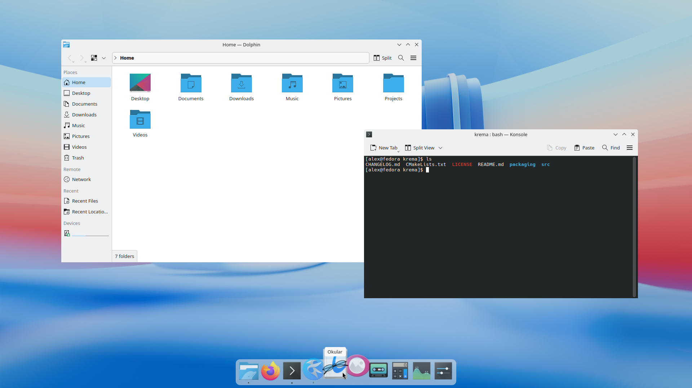
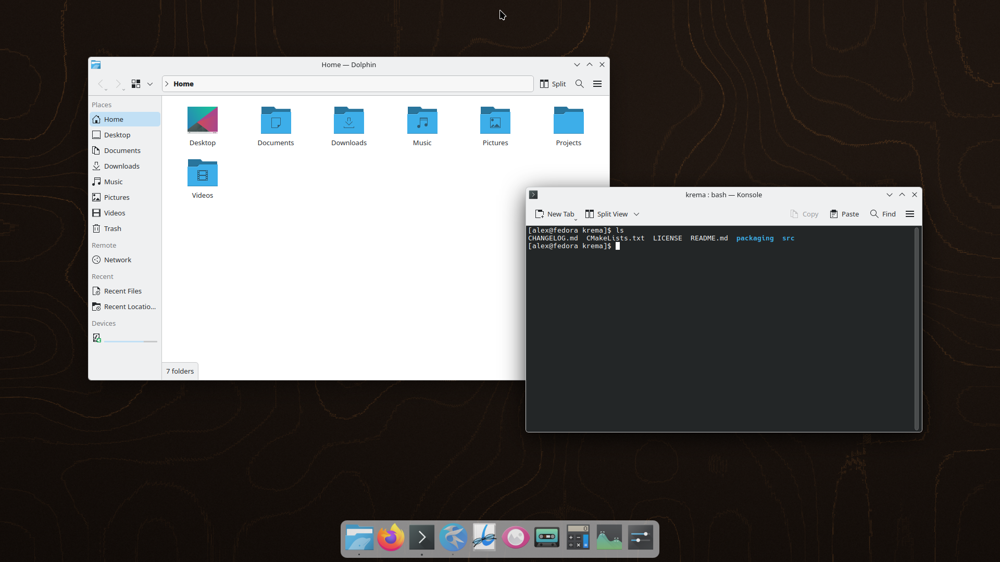
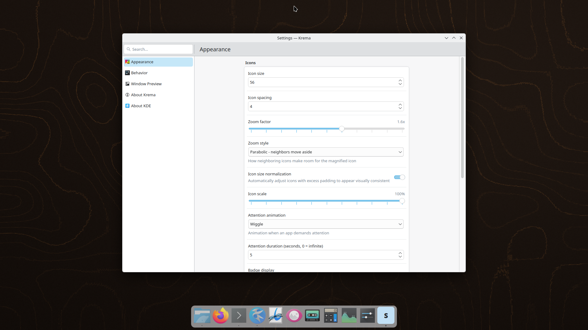

<h1 align="center">
  <picture>
    <source media="(prefers-color-scheme: dark)" srcset="branding/logo/krema-lockup-dark.svg">
    
  </picture>
</h1>

<p align="center"><strong>The zooming dock for KDE Plasma 6, native to Wayland.</strong></p>

<p align="center">

[](#roadmap)
[](https://www.gnu.org/licenses/gpl-3.0)
[](https://kde.org/plasma-desktop/)
[](https://www.qt.io/)
[](https://krema.bhyoo.com/)

</p>

<p align="center">
  <a href="https://krema.bhyoo.com/">Website</a> ·
  <a href="#installation">Install</a> ·
  <a href="ROADMAP.md">Roadmap</a> ·
  <a href="CHANGELOG.md">Changelog</a>
</p>

> **Note:** Krema is under active development. Core features are functional, but some features are still in progress. See the [Roadmap](ROADMAP.md) for details.

A lightweight, high-performance dock for KDE Plasma 6 — spiritual successor to [Latte Dock](https://github.com/KDE/latte-dock).

Krema brings back the beloved dock experience for KDE Plasma users who miss Latte Dock. Built from scratch with C++23, Qt 6, and KDE Frameworks 6, it delivers smooth parabolic zoom animations, live window previews via PipeWire, and deep native integration with the Plasma desktop.

## Why Krema?

- **Your dock is back** — Krema picks up where Latte Dock left off, purpose-built for Plasma 6
- **A dock that speaks Plasma** — Uses KDE's own frameworks (Kirigami, KConfig, KColorScheme, KGlobalAccel) and respects your theme, shortcuts, and desktop conventions
- **Lightweight by design** — GPU-accelerated rendering via QRhi, Wayland-native via Layer Shell, lazy resource allocation
- **Make it yours** — 4 background styles including acrylic frosted glass, configurable zoom, spacing, and position

## Screenshots



<table>
  <tr>
    <td></td>
    <td></td>
  </tr>
</table>

## Features

### Core Dock
- **Parabolic Zoom** — macOS-style magnification on hover that pushes neighbouring icons aside, with an optional in-place style
- **Zoom Animation Duration** — Set the hover zoom transition baseline from 0 to 1000 ms (default 100 ms) for Parabolic and In place styles; 100 ms preserves the normal-speed zoom feel while Plasma animation scaling still applies
- **Icon Size Normalization** — Auto-detects icon padding and scales for uniform appearance
- **Indicator Dots** — Visual markers for running applications
- **Pin/Unpin** — Keep favorite apps in the dock
- **Context Menu** — Right-click for pin, close, new instance (KDE Breeze native)
- **Mouse Wheel Cycling** — Scroll to switch between windows of the same app
- **Single-Window Click Action** — Activate by default; optionally minimize the active window with a left click, while clicking a minimized or background window still restores or focuses it
- **Grouped-Window Click Action** — Cycle through windows by default, or independently choose previews of all windows or minimize only the currently active window; with no active group window, the minimize choice restores or focuses the most recently used window

### Visual Styles
- **Panel-Inherit** — Match your Plasma panel style automatically
- **Transparent** — Fully transparent dock background
- **Tinted** — Custom color with adjustable opacity
- **Acrylic / Frosted Glass** — Blur + noise texture effect

### Window Previews
- **PipeWire Thumbnails** — Live GPU-efficient window previews on hover
- **Multi-Window List** — All windows of grouped apps shown together; the optional grouped click action opens this list even with hover previews off
- **Click-to-Activate** — Click a preview to switch to that window
- **Preview Close Button** — Close windows directly from the preview popup

### Notifications & Attention
- **Notification Badges** — Badge count on dock icons via D-Bus and SmartLauncher Unity API
- **Badge Display Modes** — Choose between Number, Dot, or Off
- **6 Attention Animations** — Bounce, Wiggle, Pulse, Glow, Dot Color, and Blink
- **Task Progress Bar** — Progress indicator on dock icons (e.g. file copy in Dolphin)
- **Do Not Disturb** — Attention animations suppressed when system DND is active
- **Auto-Stop** — Attention animations stop after configurable duration (default 5s)

### Multi-Monitor & Virtual Desktops
- **Multi-Monitor Modes** — Primary monitor only, All monitors, Follow active screen, or Selected monitors
- **Per-Screen Settings** — Override icon size, edge, visibility mode per monitor
- **Follow Active Triggers** — Mouse, focus, or composite trigger for dock follows
- **Virtual Desktop Filtering** — Show all desktops, dim other desktops, or current only
- **Automatic Startup** — Launches on login, enforces single instance

Choose **Selected monitors** in Settings → Behavior, then enable the switches for the output names you want. Each selected connected output with usable geometry gets a dock. Primary-display changes and unselected monitor connections or disconnections leave retained docks and previews in place. Disconnected selections stay listed and can be removed by turning their switches off.

If the selection is empty or no selected output is usable, Krema shows a temporary dock on the primary display and a warning in Settings. The saved selection stays unchanged; reconnecting a selected monitor restores its dock and removes the fallback. Switching to another mode hides the selection controls without clearing the saved names.

In `kremarc`, `MonitorMode=3` means `SelectedScreens`; `SelectedOutputs` is a string list of exact output names such as `eDP-1` and `HDMI-A-1`. Existing values remain `0=PrimaryOnly` (default), `1=AllScreens`, and `2=FollowActive`.

### Integration & Accessibility
- **KDE Native Integration** — Kirigami UI, KDE color schemes, Plasma theme colors
- **Wayland Native** — Built on Layer Shell protocol for proper dock behavior
- **Smart Visibility** — Always visible, auto-hide, or dodge windows modes
- **Drag & Drop** — Reorder dock items, drop files onto apps, add launchers by dragging .desktop files
- **Settings UI** — Kirigami-based settings dialog (FormCard) for easy customization
- **Keyboard Accessibility** — Full keyboard navigation with AT-SPI screen reader support

### Keyboard Shortcuts

| Shortcut | Action |
|----------|--------|
| Meta+\` | Toggle dock visibility |
| Meta+1-9 | Activate Nth app |
| Meta+Shift+1-9 | Launch new instance of Nth app |
| Meta+Alt+D | Focus dock for keyboard navigation |
| Arrow keys | Navigate between dock items / preview thumbnails |
| Enter | Activate focused item |
| Escape | Exit keyboard navigation |

In Selected monitors mode, Toggle Dock and app-number shortcuts target the selected primary display, then the first selected output in the adopted compositor order, then the saved selection order. Focus Dock uses the dock on the cursor's screen when available; a cursor on an unselected output falls back to the same order.

## Installation

[](https://aur.archlinux.org/packages/krema)
[](https://copr.fedorainfracloud.org/coprs/isac322/krema/)
[](https://build.opensuse.org/package/show/home:isac322/krema)
[](https://launchpad.net/~isac322/+archive/ubuntu/krema)

| Distribution | Versions | Architectures |
|---|---|---|
| Arch Linux / Manjaro | Rolling | x86_64, aarch64 |
| Fedora | 42, 43, 44, Rawhide | x86_64, aarch64 |
| openSUSE Tumbleweed | Rolling | x86_64, aarch64 |
| openSUSE Slowroll | Rolling | x86_64 |
| openSUSE Leap | 16.0 | x86_64, aarch64 |
| Ubuntu | 25.04, 25.10, 26.04 | x86_64, aarch64 |
| Debian | 13 (Trixie) | x86_64, aarch64 |

<details>
<summary><strong>Arch Linux / Manjaro (AUR)</strong></summary>

```bash
yay -S krema
# or
paru -S krema
```
</details>

<details>
<summary><strong>Fedora (COPR)</strong></summary>

```bash
sudo dnf copr enable isac322/krema
sudo dnf install krema
```
</details>

<details>
<summary><strong>openSUSE (OBS)</strong></summary>

```bash
# Tumbleweed
sudo zypper addrepo https://download.opensuse.org/repositories/home:isac322/openSUSE_Tumbleweed/home:isac322.repo
sudo zypper refresh
sudo zypper install krema

# Slowroll
sudo zypper addrepo https://download.opensuse.org/repositories/home:isac322/openSUSE_Slowroll/home:isac322.repo
sudo zypper refresh
sudo zypper install krema

# Leap 16.0
sudo zypper addrepo https://download.opensuse.org/repositories/home:isac322/openSUSE_Leap_16.0/home:isac322.repo
sudo zypper refresh
sudo zypper install krema
```
</details>

<details>
<summary><strong>Ubuntu (PPA)</strong></summary>

```bash
sudo add-apt-repository ppa:isac322/krema
sudo apt update
sudo apt install krema
```

Alternatively, use the [OBS repository](https://download.opensuse.org/repositories/home:/isac322/) for Ubuntu 25.04/26.04.
</details>

<details>
<summary><strong>Debian 13 (OBS)</strong></summary>

```bash
echo 'deb http://download.opensuse.org/repositories/home:/isac322/Debian_13/ /' | sudo tee /etc/apt/sources.list.d/krema.list
curl -fsSL https://download.opensuse.org/repositories/home:isac322/Debian_13/Release.key | gpg --dearmor | sudo tee /etc/apt/trusted.gpg.d/home_isac322.gpg > /dev/null
sudo apt update
sudo apt install krema
```
</details>

<details>
<summary><strong>Building from Source</strong></summary>

### Dependencies (Arch Linux / Manjaro)

```bash
sudo pacman -S --needed \
    cmake extra-cmake-modules ninja ccache just gcc \
    qt6-base qt6-declarative qt6-wayland qt6-shadertools \
    kwindowsystem kconfig kcoreaddons ki18n \
    kglobalaccel kcolorscheme kiconthemes kcrash kxmlgui kservice \
    kirigami layer-shell-qt wayland kpipewire plasma-workspace \
    catch2
```

The build also uses Qt GUI private headers (`Qt6::GuiPrivate`). Arch's
`qt6-base` includes them. On distributions that package them separately,
install `qt6-base-private-dev` (Debian/Ubuntu), `qt6-qtbase-private-devel`
(Fedora), or `qt6-gui-private-devel` (openSUSE).

### Minimum Versions

| Dependency | Minimum Version |
|---|---|
| KDE Plasma | 6.0.0 |
| Qt 6 | 6.8.0 |
| KDE Frameworks 6 | 6.0.0 |
| CMake | 3.22 |
| C++ Compiler | GCC 13+ / Clang 17+ |

### Build & Run

```bash
just configure    # cmake --preset dev
just build        # cmake --build --preset dev
just test         # ctest --preset dev
just run          # run krema
just dev-desktop  # add a launcher and app icon for build/dev/bin/krema to ~/.local/share
just package      # Arch: build and install a package from this checkout
```

`just test` also runs the GUI integration tests on a private, headless `kwin_wayland --virtual` compositor when `kwin_wayland` and `dbus-run-session` are installed; your session and settings are not touched.

</details>

## Roadmap

See [ROADMAP.md](ROADMAP.md) for the full development roadmap.

## Acknowledgments

Krema is a spiritual successor to [Latte Dock](https://github.com/KDE/latte-dock), which served the KDE community for years as the go-to dock application. We are grateful for the Latte Dock project and the community that built and maintained it. Krema aims to carry that spirit forward for KDE Plasma 6.

## Contributing

Contributions are welcome! Please open an issue to discuss your idea before submitting a pull request.

## License

Krema is licensed under [GPL-3.0-or-later](LICENSES/GPL-3.0-or-later.txt).
